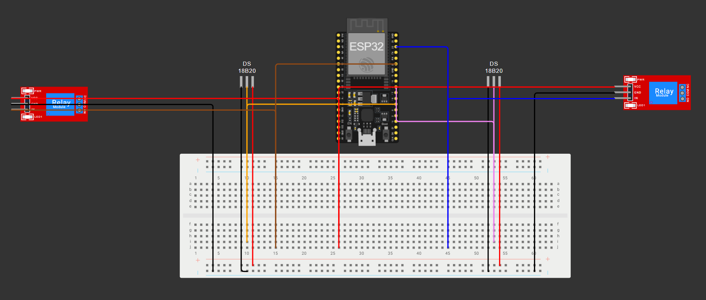
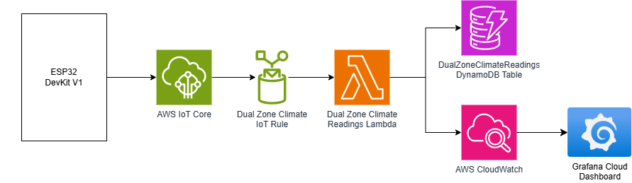
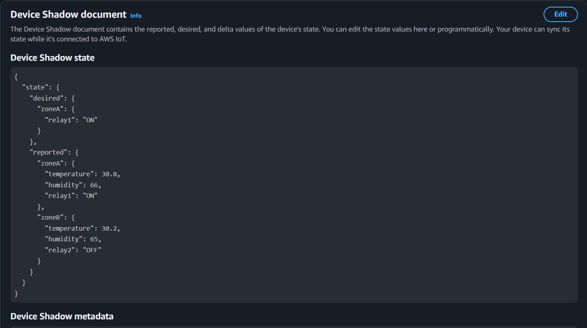
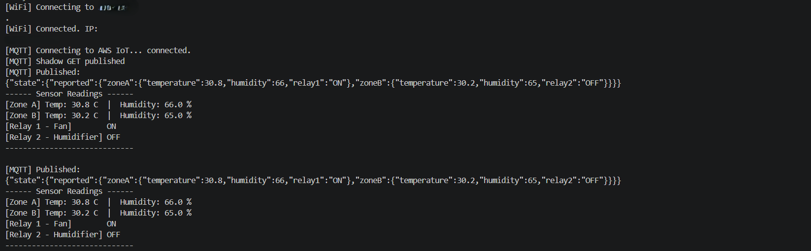
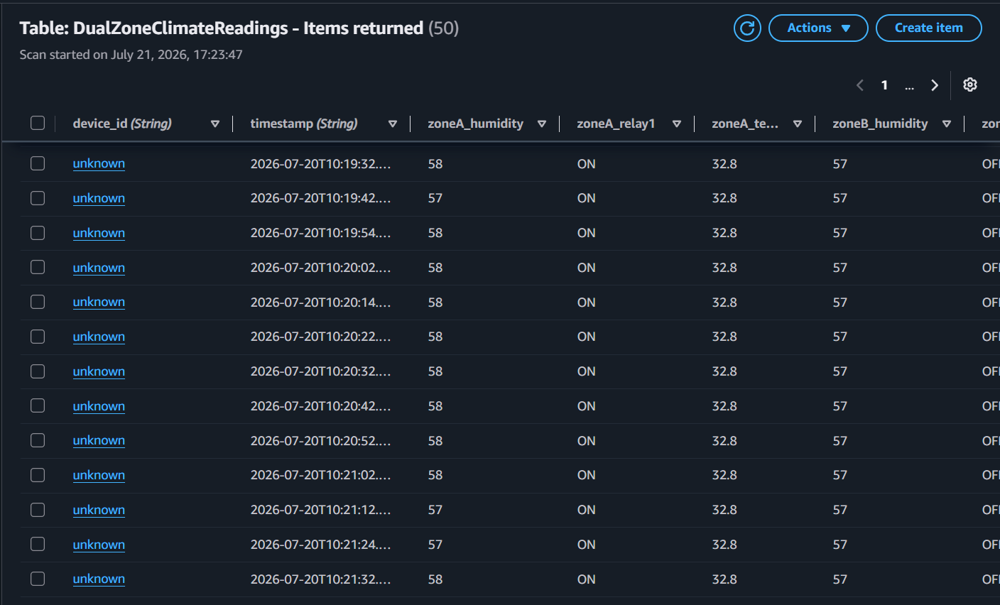
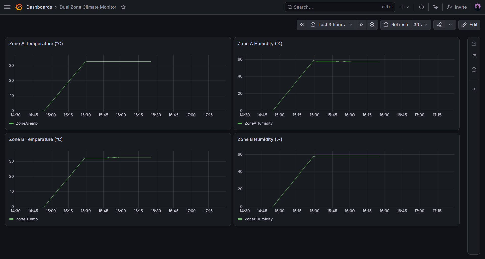
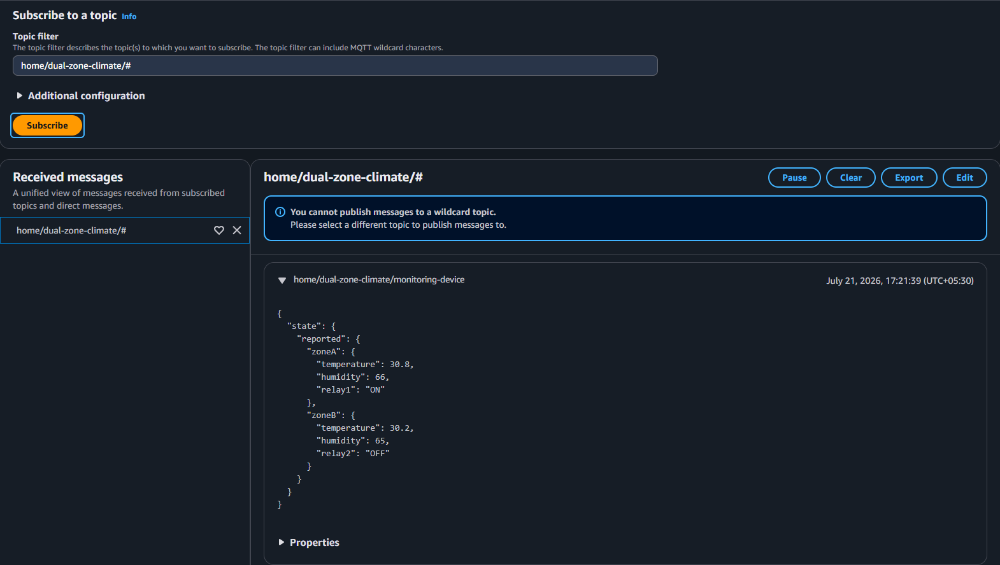

---

# Dual-Zone Climate Control with AWS IoT Device Shadows

## Overview

A dual-zone climate monitoring and control system built on an ESP32 DevKit V1 with two DHT11 temperature and humidity sensors. Sensor readings are published to AWS IoT Core over MQTT with TLS/X.509 authentication, stored in DynamoDB via Lambda, and visualised in Grafana Cloud. The key differentiator of this project is AWS IoT Device Shadows — the cloud maintains a desired relay state that can be set remotely, and the ESP32 responds to state changes in real time even if the command was issued while the device was offline.

---

## Hardware

- ESP32 DevKit V1
- 2× DHT11 temperature and humidity sensors (Zone A: GPIO 4, Zone B: GPIO 5)
- 2× 5V relay modules (Relay 1: GPIO 21, Relay 2: GPIO 22)



---

## Architecture

The ESP32 reads temperature and humidity from both zones every 10 seconds and publishes telemetry to **home/dual-zone-climate/monitoring-device**. An IoT Topic Rule forwards all messages to a Lambda function, which writes readings to DynamoDB and pushes custom metrics to CloudWatch under the **DualZoneClimateMonitor** namespace. Grafana Cloud connects to CloudWatch to visualise live sensor data.

Simultaneously, the ESP32 publishes its reported state to the AWS IoT Device Shadow. If a desired relay state has been set in the shadow that differs from the reported state, AWS generates a delta document and delivers it to the device over MQTT. The ESP32 acts on the delta immediately, updates its relay outputs, and publishes the new reported state back to the shadow.

> A diagram of the architecture is displayed below:



---

## Device Shadow

The shadow document separates sensor telemetry (reported only) from relay control (desired and reported). Desired state can be set from the AWS console, a dashboard, or any external service. Cloud-commanded relay states take priority over local threshold logic via a `deltaOverride` flag in firmware.

Reported state structure:
```json
{
  "state": {
    "reported": {
      "zoneA": { "temperature": 32.8, "humidity": 57, "relay1": "ON" },
      "zoneB": { "temperature": 32.8, "humidity": 57, "relay2": "OFF" }
    },
    "desired": {
      "zoneA": { "relay1": "OFF" }
    }
  }
}
```
> The actual structure of the device shadow document is as follows:



---

## Relay Logic

Relay 1 activates when Zone A temperature exceeds 30°C. Relay 2 activates when Zone B humidity exceeds 70%. Both relays can be overridden via Device Shadow desired state from the cloud. A `deltaOverride` flag prevents local threshold logic from overwriting cloud-commanded states.

## AWS Infrastructure (Terraform)

All 15 AWS resources are provisioned via Terraform:
- AWS IoT Thing, Certificate, Policy, and attachments
- IoT Topic Rule → Lambda → DynamoDB pipeline
- IAM Role with DynamoDB and CloudWatch permissions
- DynamoDB table with TTL enabled
- CloudWatch custom metrics under `DualZoneClimateMonitor` namespace

---

## Firmware

Written in C++ on PlatformIO. Uses a non-blocking `millis()`-based publish interval so MQTT callbacks are processed immediately without being blocked by delays. On boot, the ESP32 subscribes to shadow topics before publishing a shadow GET request to retrieve any missed desired state changes from when the device was offline.

## Key Design Decisions
- **Unnamed shadow** — one shadow per device is sufficient for this use case. Named shadows would be needed if the device had multiple independent subsystems.
- **`deltaOverride` flag** — cloud-commanded relay states take priority over local threshold logic. The flag prevents threshold evaluation from overwriting a delta-applied state.
- **Non-blocking loop** — `millis()` instead of `delay()` ensures MQTT callbacks (including shadow deltas) are processed every loop iteration rather than being blocked for 10 seconds.
- **Subscribe before GET** — the ESP32 subscribes to `get/accepted` and `update/delta` before publishing the shadow GET request, avoiding a race condition where the response arrives before the subscription is active.
- **Separate Subscribe and Receive in IoT policy** — `iot:Subscribe` requires a `topicfilter` ARN, while `iot:Receive` requires a `topic` ARN. Combining them under `topicfilter` silently blocked incoming messages including shadow deltas.

---

## Screenshots

- **Serial Monitor — Boot and Shadow Delta Received**

Shows WiFi connection, MQTT connection, shadow GET published, delta received on `$aws/things/dual-zone-climate-control/shadow/update/delta`, and relay state change reflected in the next publish.



- **AWS IoT Device Shadow**

Shows the classic shadow document with both `desired` and `reported` state populated, demonstrating the delta between them.


- **DynamoDB Records**

Shows `DualZoneClimateReadings` table with dual-zone temperature, humidity, and relay state columns populated correctly.



- **Grafana Dashboard**

Live dashboard showing Zone A temperature, Zone B humidity, and relay states from CloudWatch metrics.



- **AWS IoT MQTT Test Client**

Shows messages arriving on `home/dual-zone-climate/monitoring-device` with correct dual-zone JSON payload.



---
